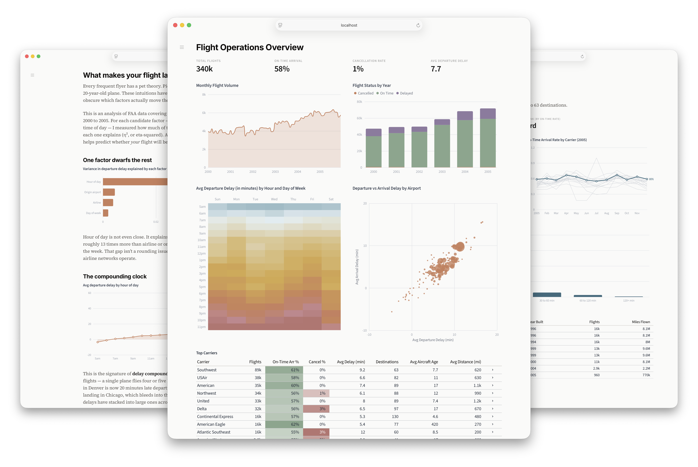
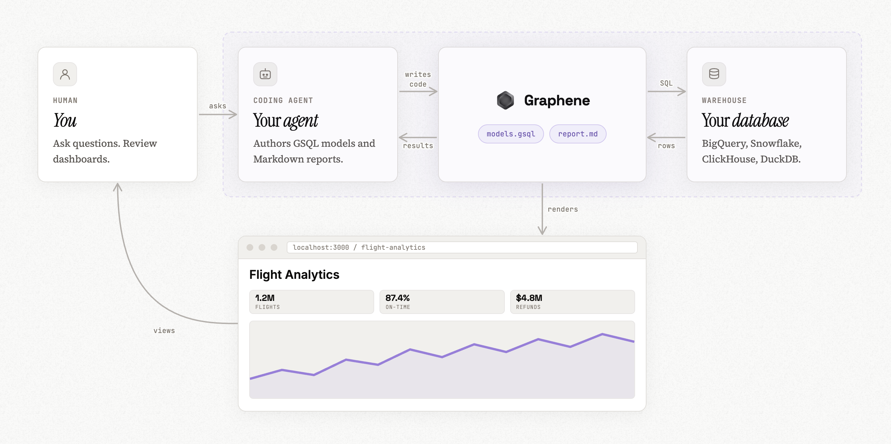

<div align="center">
  <br/>
  <a href="https://graphenedata.com">
      
  </a>
  <br/>
  <br/>
</div>

<p align="center">
  <b>Graphene</b> is a data analytics framework built for agents.
  <br/>
  Ask questions and build visualizations 10x faster when agents do the work.
</p>

<div align="center">
  <a href="https://graphenedata.com">Website</a>
  &nbsp;•&nbsp;
  <a href="https://github.com/graphene-data/example-flights">Demo Project</a>
  &nbsp;•&nbsp;
  <a href="/docs/setup.md">Setup</a>
</div>

<br/>

## Why Graphene?

Graphene is an everything-as-code analytics framework for SQL-based data exploration, visualization, and reporting. It is designed with coding agents in mind as the primary user persona.

It provides two critical pieces that allow coding agents to do better data work:

1. **A semantic layer**, which yields more accurate queries. GSQL combines the power of SQL with the governance of metrics and modeled joins.
2. **A dashboard file type**, which yields more consistent and polished visuals compared to raw Python or Javascript.

**Design goals**

- Token efficiency. Languages are designed to be brief with minimal boilerplate.
- Agent ergonomics. Graphene is controlled entirely via CLI. All documentation is inside our agent skill.
- High ceilings. GSQL follows ANSI and supports over 170 functions; Graphene's visualizations support anything that can be expressed with ECharts.

### Versus traditional BI

We believe coding agents coupled with an everything-as-code analytics stack beats traditional BI in several ways:

- Broad ecosystem of SOTA LLMs, harnesses, skills, and tools
- Leverage business-wide context from other tools or repos
- Perform end-to-end tasks across tools, where analytics is just one step
- More graceful change management and bulk refactors
- Easily promote/demote logic into or out of the semantic layer
- Version control and CI. Revert agent mistakes. Run tests on mission-critical dashboards.
- Tight, complete iteration loops. Agents can validate before running, view dashboards, and iterate locally
- Leverage continuous agents for self-healing codebases

### Open, forever

Graphene is free to use, forever. Your business logic lives in your repo and is never locked into a contract with us.

### Rich visualizations

Graphene pages support visualizations, input components for filtering and dynamic behaviors, and layout modes for monitoring-oriented dashboards vs. narrative-oriented notebooks.



### Powerful, next-generation semantic layer

Traditional semantic layers give you governance at the expense of capability. They tend to expose niche query APIs that agents aren't familiar with.

GSQL's goal is to bring governance _without_ sacrificing capability. It behaves like regular SQL—with CTEs, subqueries, window functions, set operators, and more—but also adds in the concepts of measures and modeled joins from semantic layers.

GSQL is inspired by [Malloy](https://github.com/malloydata/malloy), from the creators of LookML Lloyd Tabb and Michael Toy, but implements it as good old SQL for agent familiarity.

## Get started

- [Try the demo project](https://github.com/graphene-data/example-flights)
- [Create a new Graphene project](/docs/setup.md)

Graphene currently supports Snowflake, BigQuery, ClickHouse, and local data (via DuckDB) as data sources. It is easy for us to add more - just ask.

Once your project is set up, simply start the dev server via `npm exec graphene serve` (or `pnpm graphene serve`, etc. based on your package manager) and then prompt your coding agent to do analytics work: answer a data question, build a dashboard, edit the model, etc.

## How it works

Graphene itself is a CLI which can be installed via npm (or pnpm, yarn, etc.). The CLI can run and compile GSQL queries, render pages in the browser, check syntax, print screenshots, and more.

A Graphene project can either be a standalone repo or a directory within a larger codebase (such as dbt). It is comprised of _semantic models_ via .gsql files and _pages_ via .md files.



### GSQL and Graphene markdown

Semantic models are defined like so:

```sql
table orders (
  id BIGINT
  user_id BIGINT
  amount FLOAT
  status STRING

  join one users on user_id = users.id  -- many orders per user

  is_complete: status = 'Complete'      -- dimension (scalar expression)
  revenue: sum(amount)                  -- measure (agg expression)
  aov: revenue / count(*)               -- measures can compose
)

table users (
  id BIGINT
  name VARCHAR

  join many orders on id = orders.user_id
)
```

Models are then queried via `select`, either directly via CLI or inside a Graphene markdown page like this.

````md
```sql top_customers
select
  users.name as name,   -- Use the dot operator to traverse the modeled join relationship
  revenue               -- Invokes the measure
from orders             -- A join statement here is not needed
group by 1
order by 2 desc
limit 10
```

<BigValue data="orders" value="revenue" />
<BarChart data="top_customers" x="name" y="revenue" />
````

## Documentation

Graphene's entire documentation ships as an agent skill in the Graphene npm package. The source files are available [here](/docs).

## FAQ

<details><summary><b>Why coding agents?</b></summary>
  <br/>
  Context, mostly. If your BI stack lives in a folder right next to the rest of your company’s data and code, an agent can make smarter decisions on what it should be analyzing and why it matters.
  <br/><br/>
  The reverse is also true. If you’re working on building out some new feature or a recommendation for a new client, the agent doing that work can ground it’s approach in real data and past analytical insights.
  <br/><br/>
  Lock-in is the other big reason we hear. Folks post-SaaS are wary of having their data and dashboards locked away in some proprietary tool, or forced to use a single LLM provider. With Graphene, you own all the files in your repo. You can use whatever agent or LLM you’d like.
</details>

<details><summary><b>How do you make money?</b></summary>
  <br/>
  We’re building out Graphene Cloud as a turnkey solution to host the dashboards and reports your agent builds. We also host an MCP server and Slack bot that you can use for quick questions. If you'd like to pilot it, contact us <a href="https://graphenedata.com/contact-us">here</a>.
</details>

<details><summary><b>So does everyone have to use git and a coding agent to use Graphene for BI?</b></summary>
  <br/>
  If you just want to use this project and nothing more, yes. Our managed service, Graphene Cloud, offers a Slack agent, MCP server, and browser-based SaaS experience.
</details>

<details><summary><b>Is my data team out of a job?</b></summary>
  <br/>
  No, but we think the nature of the work is going to change. Instead of manually building out reports, data experts are going to be shaping the skills, models, and tools that the rest of their team uses to answer data questions.
  <br/><br/>
  Data teams are going to be focused on guiding agents on how to approach the trickiest and most nebulous data questions at a company. Questions that still require a data expert’s taste to get a good solution.
</details>

<details><summary><b>Can’t I just vibe code dashboards?</b></summary>
  <br/>
  You could! In fact a lot of the folks we’ve talked to have started down this route. The main problem you’ll run into is consistency. The look and feel of your dashboards and reports are all over the place, and in the worst case they end up using different formula to compute the same key metric.
  <br/><br/>
  GSQL codifies metrics into deterministic objects you can directly invoke in queries. Not only does this ensure that every use of "EBITDA" will be the same, the metadata tags we attach can hint our charts into formatting data correctly.
  <br/><br/>
  Graphene raises the floor so that pages you generate with the help of an agent look beautiful by default, so you can move faster with less tokens.
</details>

<details><summary><b>What software license does this use?</b></summary>
  <br/>
  Graphene is licensed under the Elastic License 2.0 which allows you to use it for internal use cases for free, forever. If you would like to build your own commercial application with Graphene, please contact us <a href="https://graphenedata.com/contact-us">here</a>.
</details>
